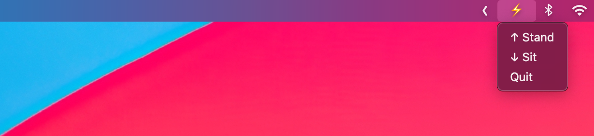

# Stand – macOS Menubar App

Menu bar utility app (macOS) for controlling a standing desk.

See `Makefile` for how to install, debug, build, and release. Or download the [latest release](https://github.com/visini/stand/releases).
